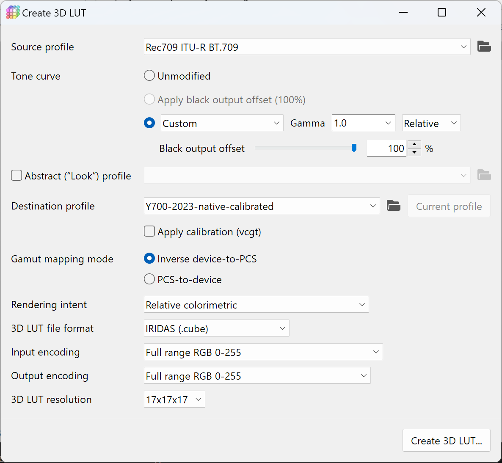

# QDCM-DIY

Tools to bring your own calibration to **rooted** Qualcomm-SoC-based Android devices.

Disclaimer: All QDCM logic here is reverse-engineered. I am not responsible for any damage caused by using this tool.

## Installation

<details><summary>Windows Command Prompt (click to expand)</summary>

```batch
git clone https://github.com/dantmnf/qdcm-diy
cd qdcm-diy
py -m venv venv
venv\Scripts\activate.bat
pip install -r requirements.txt
```

</details>

<details><summary>Windows PowerShell (click to expand)</summary>

```powershell
git clone https://github.com/dantmnf/qdcm-diy
cd qdcm-diy
py -m venv venv
& .\venv\Scripts\activate.ps1
pip install -r requirements.txt
```

</details>

<details><summary>Linux / macOS (click to expand)</summary>

```sh
git clone https://github.com/dantmnf/qdcm-diy
cd qdcm-diy
python -m venv venv
source venv/bin/activate
pip install -r requirements.txt
```

</details>

## Workflow

### Identify panel name

```sh
# POSIX sh syntax, could be simpler in Android mksh / BusyBox ash
panel_node="$(tr ' ' '\n' < /proc/cmdline | grep msm_drm.dsi_display0= | cut -d= -f2 | cut -d: -f1)"
panel_name_path="$(echo /sys/firmware/devicetree/base/soc/qcom,mdss_mdp@*/"$panel_node"/qcom,mdss-dsi-panel-name)"
panel_name="$(tr ' ' _ < "$panel_name_path")"
echo "$panel_name"
```

### Identify QDCM variant

| SoC | QDCM variant | Calibration file |
| --- | ------------ | ----------------------- |
| Snapdragon 835 (MSM8998) <br> *to* <br> Snapdragon 888 (SM8350) | “Old” | `/vendor/etc/qdcm_calib_data_${panel_name}.xml` |
| Snapdragon 8 Gen 1 (SM8450) <br> *and newer* | “New” | `/vendor/etc/display/qdcm_calib_data_${panel_name}.json` |

For other SoCs, check existence of calibration file to determine QDCM variant.

### Pull stock calibration data

```sh
adb -d pull "/vendor/etc/qdcm_calib_data_${panel_name}.xml"
# or
adb -d pull "/vendor/etc/display/qdcm_calib_data_${panel_name}.json"
```

### Identify QDCM mode used in the system

Select a specified color mode from system settings, we will replace this mode with our own calibration data.

```sh
adb -d shell "dumpsys SurfaceFlinger | grep 'Current Color Mode:'"
```

For the “old” QDCM, the output will be like:

```yaml
Current Color Mode: demo_srgb
```

For the “new” QDCM, the output will be like:

```yaml
Current Color Mode: gamut 1 gamma 1 intent 1 Dynamice_range SDR
```

Usually there are 3 modes:

* SDR sRGB
* SDR Display P3
* HDR

You need to use some app to switch to each mode and run the command to identify the mode names. Examine the calibration data file with proper tools to identify input format for each mode.

Example: In Google Chrome, set [chrome://flags/#force-color-profile](chrome://flags/#force-color-profile) to “Display P3 D65”, then run the command, the output will be the mode used for SDR Display P3.

### Disable stock calibration data

Use Magisk or KernelSU to replace the stock calibration file with an empty file.

### Calibrate & characterize

Use DisplayCAL “Web @ localhost” to create a profile.

### Patch stock calibration data

Create 3D LUT from the profile:



Settings explained:

* **Source profile**: follow input format of the QDCM mode, “Rec709” for sRGB, “DCI-P3/SMPTE-431-2 D65” for Display P3
* **Tone curve**: since we have a 3×1D LUT applied before the 3D LUT, we could give linear (Custom with Gamma 1.0) input to the 3D LUT for better interpolation
* **Destination profile**: the profile you just created
* **Apply calibration (vcgt)**: don’t check it since we will have another 3×1D LUT applied after the 3D LUT
* **Rendering intent**: use “Relative colorimetric” if you specified custom while point during calibration, otherwise “Absolute colorimetric with white point scaling” is recommended.
* **Others**: use settings in the screenshot

You will likely need to create two or three 3D LUTs for sRGB, P3, and HDR (if available) modes.

We can make the 3D LUT output in a more linear scale for even better interpolation:

```sh
./qdcm-diy merge-lut displaycal-output.cube srgb-to-linear.cube qdcm-3dlut.cube
./qdcm-diy merge-lut linear-to-srgb.cube displaycal-output.cal qdcm-output-shaper.cube
```

> Ideally we should use TRCs in ICC profile to do the conversion, but using sRGB transfer function here is just fine (TM) in most cases.

Now we can replace calibrration data in the stock calibration file.

```sh
./qdcm-diy patch qdcm_calib_data_${panel_name}.xml --mode demo_srgb --input-shaper srgb-to-linear.cube --3dlut qdcm-3dlut.cube --output-shaper qdcm-output-shaper.cube
```

This will modify the calibration data file in-place.

Repeat the steps for other modes.

### Apply patched calibration data to device

Use Magisk or KernelSU to replace the stock calibration file with the patched one.

For the “new” QDCM, you can also place new calibration file to `/mnt/vendor/persist/display/factory_calib_data_${panel_name}.json`. As the path suggests, it can survive OTA updates, factory resets, and even bootloader re-lock. However, it is recommended to test the calibration data with Magisk / KernelSU first before placing it there.

> **Be ware of file permission and SELinux context!**
> 
> The patched file needs to be readable by hwcomposer HAL.
